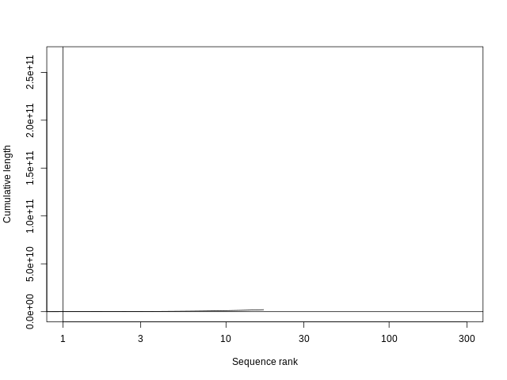

# HW4
Firstly, after logging into the HPC, the directory for the homework is made.
``` bash
cd /pub/jje/ee282/$USER
mkdir hw4
cd hw4
```


## Summarize partitions of a genome assembly
The script "01_partition_summary.sh" is used. The output file "reports.txt" shows that
> For sequences with length > 100 kb, there are 0 bases in total, (0 Ns, 0 sequences).
>For sequences with length <= 100 kb, there are 6178042 bases in total, (662593 Ns, 1863 sequences).
>For all sequences, there are 143726002 bases in total, (1152978 Ns, 1870 sequences).

And the sequence length distribution for whole genome, sequences less than or equal to 100 kb, and sequences greater than to 100 kb


And the GC% distribution for whole genome, sequences less than or equal to 100 kb, and sequences greater than to 100 kb


And the cumulative genome size sorted from largest to smallest sequences for whole genome, sequences less than or equal to 100 kb, and sequences greater than to 100 kb




## Genome assembly
The script "02_nanopore_assembly.sh" is used for assembly.

The N50 is calculated with the script "03_n50.sh". The output file "n50.txt" says
>4494246

The MUMmer plot is generated by the script "04_mummer_plot.sh". There are errors about fonts in gnuplot.


A plot generated by the script "05_cdfplot.sh" is used to compare assembly to both the contig assembly and the scaffold assembly.


The BUSCO result is generated with the script "". It says

> BUSCO was run in mode: genome
>        C:0.5%[S:0.5%,D:0.0%],F:1.1%,M:98.4%,n:2799
>        13      Complete BUSCOs (C)
>        13      Complete and single-copy BUSCOs (S)
>        0       Complete and duplicated BUSCOs (D)
>        32      Fragmented BUSCOs (F)
>        2754    Missing BUSCOs (M)
>        2799    Total BUSCO groups searched